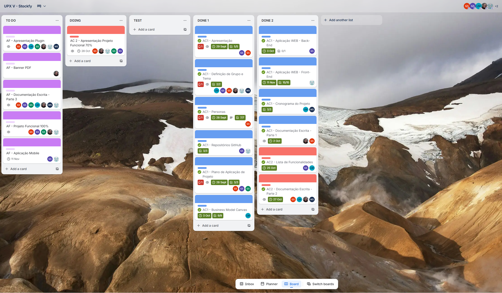

# STOCKFY - API

Sistema completo para gerenciamento de Ativos desenvolvido para o projeto de extensão UPXV do Centro Universitário FACENS.

#### Arquitetura
Esta aplicação consiste numa API Mínima construída em cima do framework ASP.NET Core e .NET 8, e escrita em C#, por ser a _stack_ mais familiarizada pelo desenvolvedor.
Inicialmente, tentou-se implementar a arquitetura em camadas (Serviços, Repositórios, Controladores...), mas os planos precisaram ser mudados para permitir uma prototipação mais veloz.
Desse modo, a lógica foi separada end-point por end-point seguindo o conceito das API mínimas.
Concomitantemente, a fim de simplificar o gerenciamento de dependências e referências, um único módulo (Assembly) foi criado.

#### Persistência
Os dados são persistidos num banco MySQL e consolidados com a ORM do Entity Framework Core, presente em praticamente todo projeto .NET moderno.

#### Bibliotecas Utilizadas
Para a validação de fluxos de informação, foi utilizada a biblioteca FluentValidation, cuja fama e facilidade de uso constituiram os motivos de sua escolha para a aplicação.
Para a geração dos códigos QR, usou-se do pacote ZXing para .NET, juntamente com o renderizador de imagem do SkiaSharp, ambos de fácil uso e disponibilidade.

Desenvolvida por: [Gabriel Rosa da Silva, RA 237069](https://github.com/GabrielRosa835)

#### Trello
Link: [Stockfy](https://trello.com/b/MviKx4u8/upx-v-stockfy)  
Print: 
